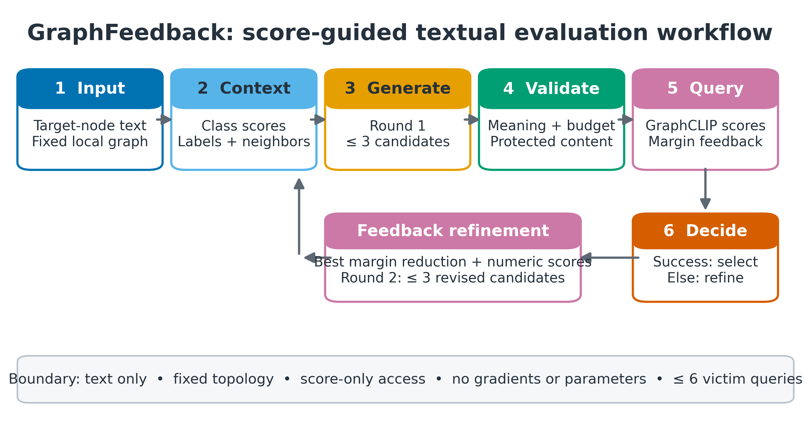
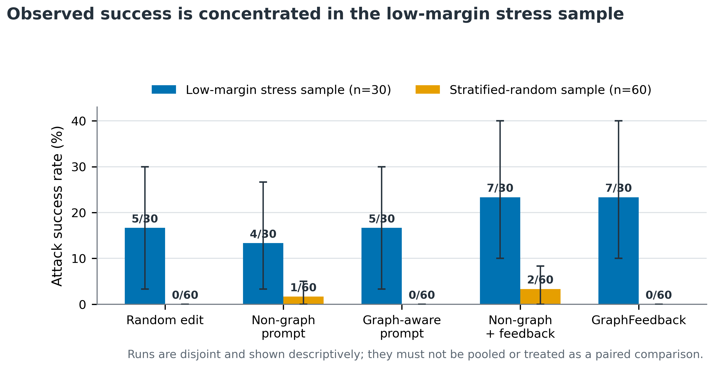

# GraphFeedback: Score-Guided Black-Box Textual Robustness Evaluation of GraphCLIP

## Abstract

Text-attributed graph foundation models expose a robustness surface that is not captured by conventional edge- or feature-space perturbations: small natural-language edits to an existing node may alter its semantic representation while leaving graph topology unchanged. This study presents GraphFeedback, a bounded two-round black-box search procedure that uses observed GraphCLIP class scores to refine graph-aware textual candidates. A 30-node stratified low-margin stress test produced 7/30 GraphFeedback successes, compared with 5/30 for its matched one-round graph-aware baseline. A frozen, non-overlapping 60-node class-balanced random experiment did not reproduce the effect: GraphFeedback and the graph-aware baseline both achieved 0/60. The combined evidence demonstrates local feasibility near selected decision boundaries but does not support population-level superiority.

## Research questions

The study asks whether a second candidate-generation round informed by actual GraphCLIP score changes can identify additional valid label-changing texts under the same six-query budget as one-round prompting, and whether any signal observed on deliberately selected lower-margin nodes persists on an independent class-balanced random sample.

## Threat model

The victim is a frozen released GraphCLIP checkpoint evaluated in zero-shot node classification. The evaluator has score-only black-box access: it can observe the six class scores but cannot inspect gradients, hidden representations, training data, or victim parameters. Candidate text is encoded with the same `all-MiniLM-L6-v2` encoder used to construct GraphCLIP node features. Only the root-node feature is replaced in an in-memory copy of the ego-graph. Graph topology, neighbouring features, positional encodings, class prompts, and model parameters remain fixed.

For target node \(i\), let \(p_{i,c}(x)\) be the score assigned to class \(c\) after setting the target text to \(x\). The predicted class is

\[
\widehat{y}_i(x)=\arg\max_{c}p_{i,c}(x).
\]

For an initially correct node with label \(y_i\), the clean-class margin is

\[
m_i(x)=p_{i,y_i}(x)-\max_{c\neq y_i}p_{i,c}(x).
\]

When no candidate changes the label, the valid candidate with the smallest margin becomes the current best direction for refinement.

## GraphFeedback

GraphFeedback divides the six-query budget into at most three initial graph-aware candidates and at most three feedback-guided refinements. Each candidate is parsed and filtered before victim evaluation. If a valid candidate changes the predicted class, evaluation stops. Otherwise, the generator receives the current best candidate, its class scores, its clean-class margin, its change from the original margin, and a compact account of first-round outcomes. The second round refines the current candidate locally while all validity checks remain anchored to the original text.

Candidate text must have a length ratio between 0.80 and 1.20, change no more than 20% of aligned tokens, achieve semantic cosine similarity of at least 0.85 under `all-mpnet-base-v2`, and preserve protected numbers, citations, negations, polarity terms, acronyms, and detected model names. Invalid generations consume generation effort but do not consume victim-model queries.

The evaluated methods are random editing, generic paraphrasing, one-round non-graph prompting, one-round graph-aware prompting, non-graph score feedback, and GraphFeedback. The feedback variants reuse the first three evaluated candidates from their matched one-round baselines, making the first round identical rather than merely similar.

## Experimental design

Clean GraphCLIP inference reproduced 442 correct predictions among 638 CiteSeer test nodes (69.28%). The generator was `Qwen/Qwen2.5-0.5B-Instruct`, candidate node text was encoded with `all-MiniLM-L6-v2`, and semantic filtering used `all-mpnet-base-v2`.

The formal evaluation separates two samples:

| Component | `stress30v1` | `random60v1` |
|---|---|---|
| Selection | Stratified lower-margin correct nodes | Stratified random correct nodes |
| Sample size | 30; five per class | 60; ten per class |
| Seed | 88 | 240726 |
| Overlap | — | 0 nodes |
| Maximum queries | Six per node and method | Six per node and method |
| Edit and semantic limits | ≤20%; similarity ≥0.85 | Identical frozen limits |

The stress run evaluates mechanism feasibility near the decision boundary. The confirmatory run was frozen before viewing outcomes and tests whether the stress signal extends to a broader class-balanced random sample. The two runs are analysed separately and never pooled.

## Metrics and statistics

For the initially correct target set \(\mathcal{T}\), define

\[
s_i=\mathbb{I}\left[x_i^\star\text{ is valid}\land\widehat{y}_i(x_i^\star)\neq y_i\right].
\]

Attack success rate is

\[
\mathrm{ASR}=\frac{1}{N}\sum_{i=1}^{N}s_i.
\]

Nodes without a valid candidate remain in the denominator as failures. The analysis also reports attacked-subset accuracy, no-valid-candidate rate, semantic similarity, aligned changed-token ratio, clean-class margin reduction, victim queries, and generation time. ASR intervals use 10,000 seeded node-bootstrap resamples. Within each run, paired binary outcomes are compared with an exact McNemar-style binomial test. Because successes and discordant pairs are sparse, these tests are descriptive and have low power.

## Results

### Low-margin stress sample

| Method | Success | ASR, 95% bootstrap CI | Mean queries | Median margin reduction |
|---|---:|---:|---:|---:|
| Random edit | 5/30 | 16.7% [3.3%, 30.0%] | 5.63 | 0.0709 |
| Generic paraphrase | 5/30 | 16.7% [3.3%, 30.0%] | 1.80 | 0.0892 |
| Non-graph attack | 4/30 | 13.3% [3.3%, 26.7%] | 1.80 | 0.0548 |
| Graph prompt attack | 5/30 | 16.7% [3.3%, 30.0%] | 1.90 | 0.1830 |
| Feedback without graph context | 7/30 | 23.3% [10.0%, 40.0%] | 2.77 | 0.1037 |
| GraphFeedback | 7/30 | 23.3% [10.0%, 40.0%] | 2.50 | 0.1962 |

GraphFeedback changed 7 of 30 initially correct predictions. Five successes occurred among the shared first-round candidates, and two occurred only after feedback-guided refinement. Against the matched graph prompt, there were two GraphFeedback-only successes and no graph-prompt-only success (`p = 0.5000`). Feedback without graph context also achieved 7/30, so graph context changed which nodes were affected but did not improve aggregate stress-set ASR.

### Frozen class-balanced random sample

| Method | Success | ASR, 95% bootstrap CI | Mean queries | No-valid-candidate rate |
|---|---:|---:|---:|---:|
| Random edit | 0/60 | 0.0% [0.0%, 0.0%] | 5.73 | 0.0% |
| Non-graph attack | 1/60 | 1.7% [0.0%, 5.0%] | 2.02 | 15.0% |
| Graph prompt attack | 0/60 | 0.0% [0.0%, 0.0%] | 1.53 | 28.3% |
| Feedback without graph context | 2/60 | 3.3% [0.0%, 8.3%] | 2.87 | 3.3% |
| GraphFeedback | 0/60 | 0.0% [0.0%, 0.0%] | 2.27 | 15.0% |

The confirmatory run did not reproduce the GraphFeedback signal. GraphFeedback and graph prompting both achieved 0/60. Feedback without graph context achieved 2/60, compared with 1/60 for its one-round baseline. GraphFeedback had no unique success against non-graph feedback, which had two (`p = 0.5000`).

All methods declined on the random sample. GraphFeedback decreased from 23.3% to 0.0%, graph prompting from 16.7% to 0.0%, and random editing from 16.7% to 0.0%. Target-node difficulty therefore provides a more credible explanation than a method-specific failure.

## Reproducibility

Both experiments were executed from frozen configurations. The saved local evidence records generation, parsing, filtering, victim scoring, selection, feedback, seeds, thresholds, model versions, environment information, and checkpoint/data hashes. The stress experiment produced 158 query-level feedback trajectories and the confirmatory experiment 308. Public files in this repository contain aggregate results and deterministic derived tables rather than raw node text or generated candidates.

## Limitations

The study evaluates one GraphCLIP checkpoint, one dataset, one local 0.5B generator, and limited samples. Successful outcomes are sparse, producing wide intervals and low-powered paired tests. Semantic fidelity is screened automatically rather than through blinded human annotation. The confirmatory seed also affects upstream stochastic graph construction, making the second run an independent replication rather than an identical-universe resample.

## Conclusion

GraphFeedback provides a reproducible framework for topology-preserving textual robustness evaluation of GraphCLIP. It found two refinement-only successes on a deliberately lower-margin stress sample, but the effect did not persist on a frozen class-balanced random sample. The evidence supports closed-loop score feedback as a locally useful search heuristic near selected decision boundaries. It does not establish broad model insecurity, guaranteed semantic preservation, or general GraphFeedback superiority.

## References

[1] Y. Zhu, H. Shi, X. Wang, et al., “GraphCLIP: Enhancing Transferability in Graph Foundation Models for Text-Attributed Graphs,” *Proceedings of The Web Conference*, 2025.

[2] X. Xu, K. Kong, N. Liu, et al., “An LLM Can Fool Itself: A Prompt-Based Adversarial Attack,” *Proceedings of the International Conference on Learning Representations*, 2024.

[3] R. Lei, Y. Hu, Y. Ren, and Z. Wei, “Intruding with Words: Towards Understanding Graph Injection Attacks at the Text Level,” *Advances in Neural Information Processing Systems*, vol. 37, 2024.

[4] Z. Yu, Z. Chen, and K. He, “Query-Efficient Textual Adversarial Example Generation for Black-Box Attacks,” *Proceedings of NAACL-HLT*, pp. 556–569, 2024.
